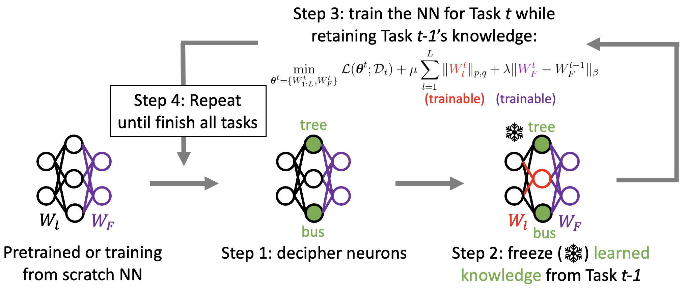
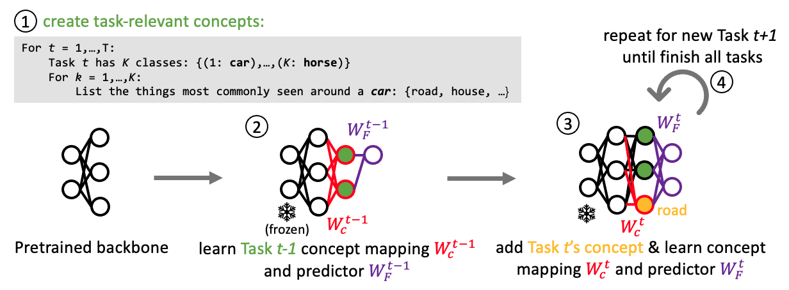

# Concept-Driven Continual Learning

This is the official implemenation of our [TMLR 2024 paper](https://openreview.net/forum?id=HSW49uvCNW): "Concept-Driven Continual Learning". 

* In this work, we propose to bring interpretability into continual learning process to mitigate catastrophic forgetting problems.
* We proposed two novel methods **Interpretability-Guided Continual Learning (IG-CL)** and **Intrinsically-Interpretable Neural Network (IN2)** that can systematically manage human-understandable concepts within DNNs throughout the training process.
* Our proposed approaches provide unprecedented transparency and control over the continual learning process, marking a promising new direction in designing continual learning algorithms. 

<p align="center">
  
</p>

<p align="center">
Overview of our Method 1: IG-CL
</p>

<p align="center">
  
</p>

<p align="center">
Overview of our Method 2: IN2
</p>

## Setup
Execute the following code to set up the code environment.
```
bash setup/setup.sh
```
For methods related to `MIR` and `DER`, please follow `setup/new_env.md` to modify the environment and code.

## Running IG-CL
### 1. Run and evaluate IG-CL strategy
Execute the following code to get the experiment results. Here we take CIFAR-10 for example.
```
python continual_learning/train_all.py --result_dir results --strategy SRT --task_num 5 --dataset cifar10 --sol sol0
```
`sol0` means `freeze-all` implementation, and `sol1` means `freeze-part` implementation.
### 2. Get experiment results
Execute the following code to get the experiment results. 
```
python evaluate/metric.py --file_dir results --strategy SRT --task_num 5 
```

## Running IN2

### 1. Get labels and classes for each task
* We need to know the classes in each task to create the corresponding concept set.
* Follow steps in `continual_learning/label_generation.ipynb` to get the classes for each task. 

### 2. Create Concept Set
Execute the following code to generate the concept set. Please put your OpenAI api key in `sandbox-lf-cbm/.openai_api_key` before running the code.

```
bash script_dir/CBM/exec_conceptset.sh
```
* For specific scenario, please modify the variables `seed_list` and `task_num` in `sandbox-lf-cbm/GPT_conceptset_processor.py` and `sandbox-lf-cbm/GPT_init_concepts.py`.
* Please see [Label-free Concept Bottleneck Models](https://github.com/Trustworthy-ML-Lab/Label-free-CBM) for more details.

### 3. Run and evaluate IN2 strategy
Execute the following code to train a model using IN2 strategy. 
```
bash script_dir/CBM/cc_cbm.sh
```

### 4. Get experiment results
Execute the following code to get the experiment results. 
```
python evaluate/metric.py --file_dir results/cc_cbm --strategy cc_cbm --task_num 5 
```

## More experiment results

* Please check `experiments/` folder for experiments in the paper
* Forward Transfer Metric: Use `avalanche.evaluation.metrics.forward_transfer` metric to get the results.


## Sources
* CLIP-Dissect: https://github.com/Trustworthy-ML-Lab/CLIP-dissect
* Label-free CBM: https://github.com/Trustworthy-ML-Lab/Label-free-CBM
* Avalanche: https://avalanche.continualai.org


## Citation
```txt
@article{yang2024conceptdriven,
  title={Concept-Driven Continual Learning},
  author={Yang, Sin-Han and Oikarinen, Tuomas and Weng, Tsui-Wei},
  journal={Transactions on Machine Learning Research},
  year={2024}
}
```
